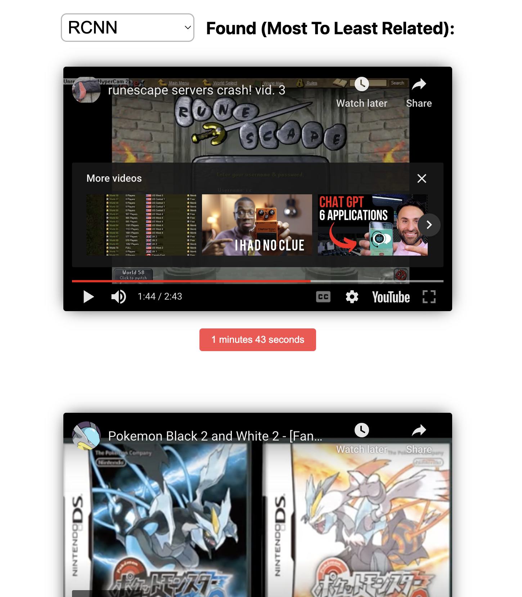

# YouTube Image Search
## A Senior Computer Science Comprehensive Project By Christopher Linscott

## What is it?

This is an user interface to allow one to query related YouTube videos (given they exist in the database)
using only images and no text (including metadata from the image). The project uses two models: Object Detection and Convolutional Neural Networks (with an included implementation of RMAC), and showcases results from all of these models to compare and/or see the models' predictions for most related videos.

## How do I get started and run the application?

### Requirements

#### Languages: `Python 3.9.1` (Use Python 3.7 <= Python 3.x < Python 3.11), `HTML-CSS-JS`

#### Dependencies: Refer to Step 2 Of Installation Or `requirements.txt` of this repository.

### Hardware / OS

#### OS: `macOS Monterey 12.3.1`

#### Processor: `2.3 GHz 8-Core Intel Core i9`

### Installation

1. Clone the repo

```sh 
    git clone https://github.com/linschris/youtube-image-search.git
```

2. Install the dependencies
```sh
    pip install -r requirements.txt (Python2)
    pip3 install -r requirements.txt (Python3)
```
### You should be good to go!

### Download tfrecords for (fake) YouTube IDs 

To gather the fake youtube ids, navigate to `data/methods/gather_tf_record_data.py` and run this file. This file contains code to fetch and store tf_records into the `data/tfrecords` directory.

### Gather YouTube videos and thumbnails from the tfrecords

To download the corresponding videos and thumbnails from the tfrecords, navigate to `data/methods/process_tf_record_data.py` which will asynchrously fetch the real YouTube IDs and upon completion of the request, will create a subprocess to download the video and thumbnails, downloading them to a directory of your choice. To run this code, simply call it like 
```python 
from data/methods import process_tf_record_data
def main():
    tf_record_data = parse_tf_records("data/tfrecords", "data/videos", None) # None or specify number of records to parse

    # Do stuff with tf_record_data here
    # ...
```

### Get frames from YouTube videos

To get the frames from the youtube videos, we can utilize useful bash scripts provided by [gsssrao](https://github.com/gsssrao/youtube-8m-videos-frames), one of which is named `generateframesfromvideos.sh`.

To call this, make another folder `frames` to store the frames of the videos in.

Next, navigate (using cd) to the parent of folder containing the videos folder and script file:
> cd data

and run the script to generate the frames from the videos (you can use whatever extension, but I would choose jpg or png):

> bash generateframesfromvideos.sh <path_to_directory_containing_videos> <path_to_directory_to_store_frames> <frames_format>

or:

> bash generateframesfromvideos.sh ./videos ./frames jpg

### Gather and store predictions of these images

Finally, we need to compute descriptions of these images. We can run `gather_predictions.py` to compute predictions for each of our images (it computes 100000 or as many images as you want at a time). Make a folder called `/predictions` or specify the db_path in the argument of `gather_predictions`.

They will be stored in:
- `./predictions/object.json` - RCNN predictions
- `./predictions/predictions.npy` - CNN predictions
- `./predictions/prediction_image_paths.json` - Map from image path to CNN predictions (in npy file array)
- `./predictions/rmac_image_paths.npy` - CNN + RMAC predictions
- `./predictions/prediction_image_paths.json` - Map from image path to CNN + RMAC predictions (in npy file array)

Your database should be good to go!

### Running the Application

To run the application, run the `run_app.py` python file.
> NOTE: do it from the comps-project folder and not any other subfolder of this project

After loading for a minute or so (due to loading the models and database), a Flask UI should be started and everything should work!

### Evaluating the Models

To evaluate the models, you can create a new test folder inside of `eval/test_images`. Using the methods above, you can make a small database inside of `eval/test_images/{insert_test_name}/predictions`. Afterward, find a query image and place inside of it `eval/test_images/{insert_test_name}/query_images`, and determine a ground truth of the top-k most relevant videos (k being whatever you want). Write the URLs of the videos inside of a file called `ground_truth.txt` inside of the test folder.

Finally, walk and run through the steps/cells of `evaluate.ipynb`. The results will show up as outputs of each cell. These results were aggregated different categories of video to create graphs and statistics for my COMPS project to evaluate whether or not it was viable!

## Results

There are two ways to view the resulting graphs:
- This Google Sheets Link: [View Here](https://docs.google.com/spreadsheets/d/1zDshoOrzodH69RnZKt5q6c5OtIIpeP_Ue9GJazMrZbs/edit?usp=sharing)
- Or, refer to the downloaded PDF located on this repo at `COMPS Evaluation Data.pdf`.

Both of these method include the raw data, the aggregated data, and the graphs beneath which represent the bold, aggregated data above it!

## Code Architecture

</img>

From a high level, this YouTube search tool is very simple. 

### The Database

After downloading the videos and grabbing the thumbnails and frames from them (as in the above sections), we compute the "descriptions" (with all the models) and create the database utilizing `gather_predictions.py` which utilizes the __Database__ class at `database.py`. 
- The models (located in the `/models` folder) compute the description using these methods:
    - `predict_images()` (AlteredXception, RMAC)
    - `predict_image_paths()` (FasterRCNN)
- These descriptions will be stored on the file directory (`/data` relatively to parent) where they can be fetched and queried by the search tool. 
- As well as, frames are stored with their corresponding frame number to determine the corresponding relevant time (of the video) when they are fetched.

### The Models

All the models are stored in the `/models` folder. The three models are:
- Base Convolutional Neural Network: `altered_xception.py`
- Convolutional Neural Network + RMAC: `faster_r_cnn.py`

There are classes to make them easy to organize the complex functions and to make computing the descriptions, querying their databases, and returning their picks for related videos very systematic (as they can share common function names such as `predict_images` and `query_image`).

### Querying 

When computing the user query image, we use the same models (from the `/models` folder) to compute the description of the query image. These descriptions are compared (per model) within the `query_image()` class function for each of the models!

To get the relevant videos (in links), we grab the video ids and corresponding times and convert them to embed links (to be used in HTML iframes to view the video in the web application) within the `get_youtube_urls()` function in `utils.py`.

### The Interface

</img>
</img>

To make the search tool interactable (and easy-to-use), a user interface is created within the `/interface` folder with [Flask](https://flask.palletsprojects.com/en/2.2.x/), [HTML, CSS, and JS](https://blog.hubspot.com/marketing/web-design-html-css-javascript). When a user submits a query image:
- The image gets passed to the `query_image` method within `query.py` in the models folder
- The models compute the descriptions, compare and query their database with their `query_image` methods
- Return the relevant videos back to the web server
    - Using HTML, CSS, and Javascript in `/interface/static`, we create a nice UI to view the relevant videos and clickable buttons to view the video at relevant times!

Additionally, to showcase and make sure the user queried the correct image, an image preview of the query image is provided after the user submits a query image. To accomplish this, the image is converted to base64 and showcased in an image div, so we can temporarily store the image on the file directory (and not have to store it beyond the length of the web session).

## Future Work
- Adding more models such as:
    - SIFT / SURF / RootSIFT
    - Ensemble Methods (Combining models like )
    - Inverted Indexing (specifically for the CNN and RMAC models)
- Adding more data
    - Only approximately one million videos compared to the billions on YouTube
    - With better hardware

